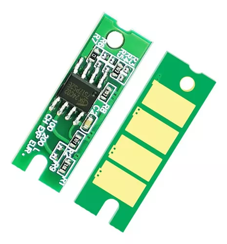
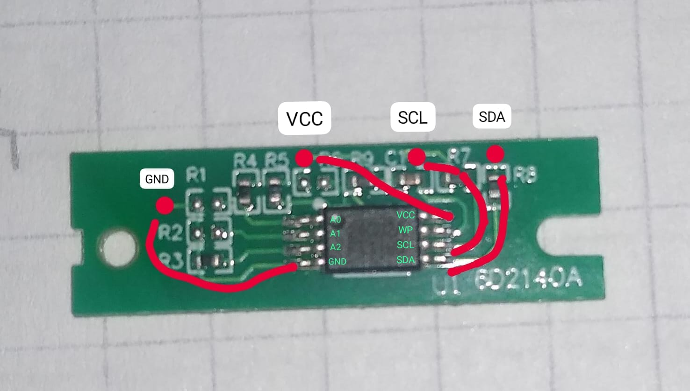
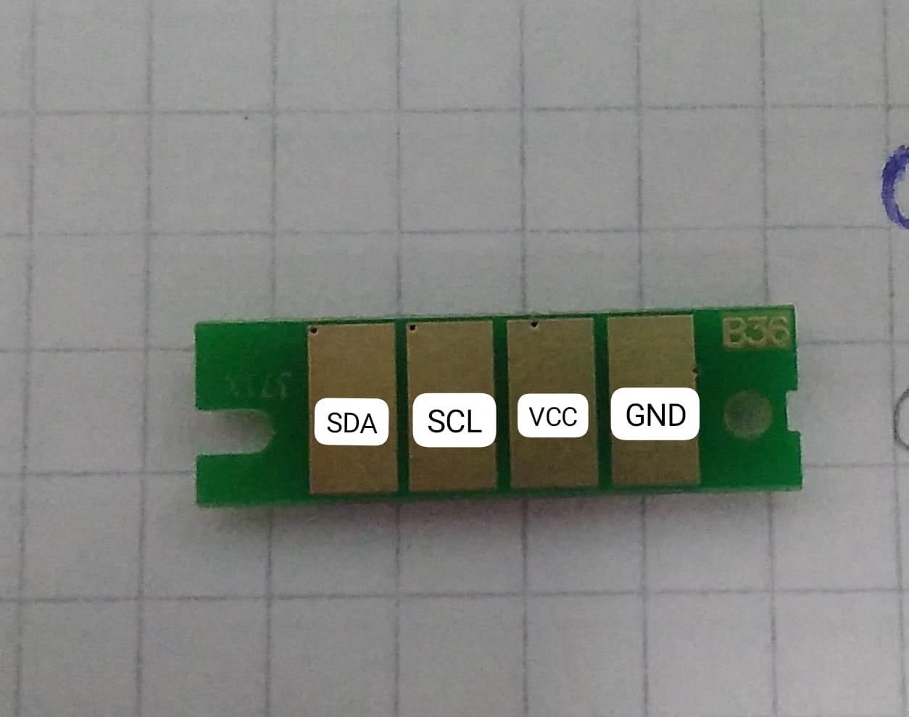
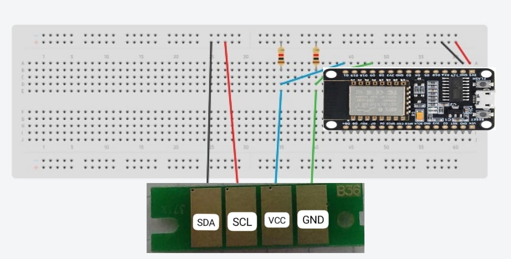
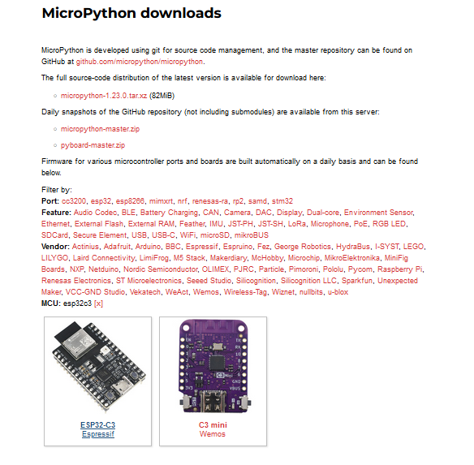
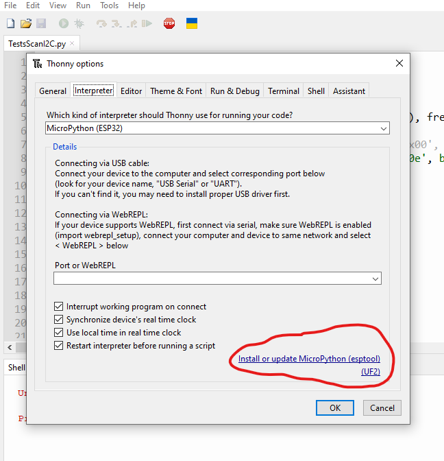
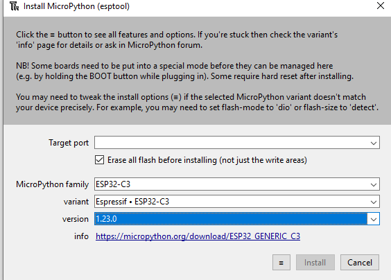
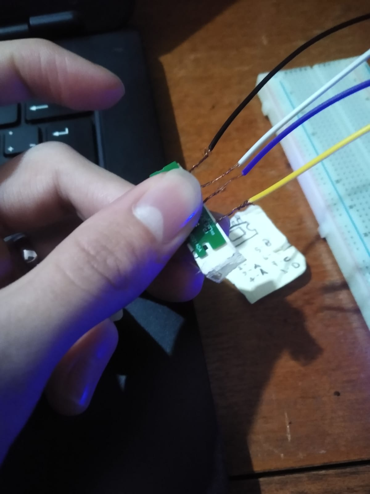
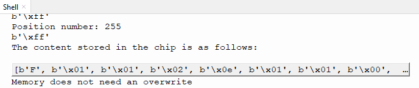
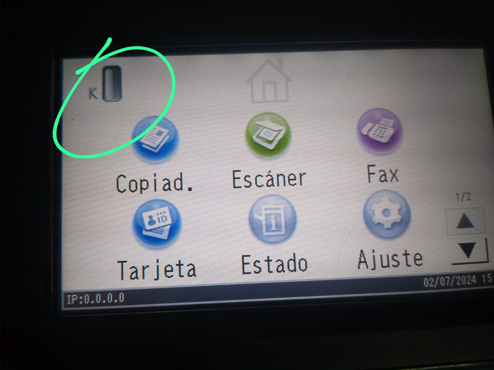

# Ricoh M320F / SP3710 Toner Chip Reset 

A Micropython script inspired by the works of [lugu](https://github.com/lugu/toner_chip_reset) and [DIYTinker](https://www.youtube.com/watch?v=Wwd5UCi9Huw&list=WL&index=1), who I greafully thank for being my source of motivation for this ongoing project. 
I'd like to express my gratitude towards the Embedded Systems professors at UNLAM, for nothing would've been possible without their support and interest in the proposed idea. 

# First things first

Getting into the matter, if you are reading this it's quite possible that you are aware of how a toner cartridge works on the surface. After a journey of printing (allegedly 7000 pages), you come across with an increasingly diminishing level of toner available, which inevitably comes to zero and halts your printing work. However, you may also have noticed that the level of toner on the printer screen does not correlate exactly to the ammount of toner left in the cartridge. So this situation prompts an idea, an incentive for a mind to delve into the depths of forums and documentation in order to come across a workaround. 
Turns out, the chips make this entire structure function due to the presence of an EEPROM memory, to which the printer writes data after each print operation. 

In case of the one we're working with, it's a [24C02A Programmable EEPROM](Misc/24C02Adatasheet%20.PDF), a memory of 256 bytes. This means that it's possible to modify its content.
So the process is as follows: 1-Identify the EEPROM Memory, 2-Identify which pad connects to each part of the circuit, 3-Obtain the content akin to a "full" chip, 4-Copy said content inside an "empty" chip, 5-Enjoy.

By further inspection, it was possible to find out the following connections of the pad:

        ________
   A2 -|        |- VCC
   A1 -| 24C02A |- Wire Protect
   A0 -| EEPROM |- SCL
   GND-|________|- SDA

Connection with the chip happens via I2C protocol, in which we connect two devices in a slave-master fashion, for which we will need three main things beside a connection to VCC and GND: A connection to SDA, a connection to SCL and the address of the slave device (the EEPROM memory). Do not worry about this, as most chips I have tested come with a default address of 83, but if you still have doubts or want to investigate further I'll leave an I2C scan repository in the Credits section.

# Step 0 : Tools

Before we get to the fun part, we have to make sure that we have the required tools for everything to work.

* An ESP32 Board/DevKit. 
* 8 Jumper wires
* A 400-point or 800-point breadboard, as this is where connections will be made.
* Two 10KOhms resistors to use as pull-up
* A small piece of cardboard or hard plastic barely bigger than the printer chip

In my case, I'm using a cheap ESP32-C3. Some of these boards require you to solder the pin headers, so keep that information in mind when acquiring one.
A multimeter is a nice tool to have as well, as it may result helpful to check which connections work properly.

# Step 1: Wiring things up

Depending on the ESP model you get, you may need to check if it comes with predefined SDA and SCL pins. In the example below, this information
is not present, so the selection of pins I used can be different than yours. This is up to you and your board.

This is a sketch of how my project is wired, for clearance.

Make sure that both the chip and the microcontroller are operating under the same voltage. My ESP-C3F operates with 3v3, while the chip does so between 1.8V and 5V. This means that 3v3 can power both devices, which can be done by using any of the 3v3 Pins as VCC for the chip.

One wire has to connect any 3v3 pin to the positive power rail, and a different one from a GND pin to the negative of the breadboard. In this case, I use the Pin 1 as my SCL and my Pin 8 as the SDA, so both of these have to go to different columns, and those columns must have a pull-up resistor to VCC. From both columns, a second pair of wires extend to a rectangular piece of cardboard. These wires are peeled off and wrapped around the cardboard in order to form straight lines for the chip to be put on top of. Another pair of wires with the same characteristics come from the positive and the negative rail.
The order is not to be ignored, and must be as follows:

left: GND (-)
middle-left: VCC (+)
middle-right: SCL
right: SDA

# Step 2: Connecting our board

With the physical part set up and ready, we move towards the software side. 
If you happen to have a brand-new board or one that doesn't have the Python interpeter flashed in, we'll handle that in this step.

My IDE of choice for this project was Thonny, and thus, the language emplied is Micropyhton. Thonny allows for a quick connection to the microcontroller and the possibility of flashing its memory and updating the MicroPython firmware from the options menu. If you prefer to use Arduino, PlatformIO or a different development environment, I'll leave resources in the Credits section that may help you find a workaround.

__Downloading the corresponding Micropython firmware__

In order to get the Micropython firmware best suited for our board, check the downloads [here](https://micropython.org/download/) and filter by port (esp32) and MCU (your board, in my case [esp32c3](https://micropython.org/download/ESP32_GENERIC_C3/)). Once you have selected the board, click on the latest generic firmware option to download it to your pc.

__Installing the firmware and setting up the interpreter__

The next step is to get Thonny IDE, which can be downloaded [here](https://thonny.org/)
Inside the IDE, go to  __Tools__ -> __Options__ -> __Interpreter__ and select __MicroPython (ESP32)__ as your interpreter.

Then click on the __Install or update MicroPython (esptool)__ option on the bottom right to procceed to the installation of the firmware directly to the board. Make sure that your ESP32 is connected to an USB port of your computer for the process to take place. From here, select the USB port your board is connected to, the esp32 version and browse for the firmware you previously downloaded in __variants__. Tick the option of "Erase flash before installing" if it's not selected, and install the firmware. 

You can check if everything is working as intended by running the command "help()" or blinking the test led that comes with your board (check the pinout to see which pin controls it).

# Step 3: Running the "Read" script

By having MicroPython running seamlessly on our boards, we can now continue to the part everyone's looking forward to. 

Notice that you might need to use more fingers / hold it by its sides

* __Clone__ this repository by clicking on the green "Code<>" button and open the "read.py" file with Thonny IDE.
* Place the chip on the cardboard platform and align it with the exposed wire strands. Do not worry if the chip is not detected at first, you just have to maneuver a bit by shifting pressure, moving it to a more fitting position or accomodating the wires.
* Make sure that you're applying pressure to the chip so that contact remains as effective as possible during the whole proccess.
* Run the script with F5 or by pressing the "Run" option on the top bar
* You should get something like this in your terminal:

If things go according to the plan, you now have a memory dump of the EEPROM memory in your terminal in the form of a list of bytes object and also an evaluation of the current state of the chip.

# Step 4: Running the "Write" script

After checking that the chip is in fact "Empty" according to the printer, this is the final step before the expected result is achieved.

Position the chip on top of the platform and align it with the copper strands, then press F5 or the Run icon to run the script. 
Same process as before, same recommendations.
Once the chip is detected, the overwrite action will take place shortly after, so be cautious in case any sudden move messes with the connection.
If you happen to see the text "Memory overwritten successfully" then congratulations, you have resetted the chip accordingly and can now use it again as though it were brand-new.

# Step 5: Enjoy your newly resetted chip/s !

If you have reached this point and the scripts did what they were meant to do, all I have left to say is Thank You for taking your time to put things together and for giving this project an opportunity.
I promise to keep updating the scripts as time goes on, be it by adding support for other printer chips or by making the scripts 
more user-friendly and less prone to errors.

# Troubleshooting 

Below is a list of common issues that you (as I did) may run into and possible solutions.

* TIMEOUT / ENODEV error: The connection with the chip got interrupted, either by moving it unintentionally or due to a shift in the pressure applied to it, ergo, less eficient contact with the copper wires. Re-run the script and make sure to hold the chip firmly while aligning it to the copper wires.

* Program stuck in i2c.scan() method : The connection with the chip seems to never fully happen. Remove the chip and place it on the platform again. If the issue persists, realign the copper wires.

* Microcontroller resets itself: Probably caused by unintended contact between the copper wires. You can mitigate this by bending the wires slightly away from each other or you can straight up work with [crocodile clips and pieces of copper](https://www.youtube.com/watch?v=Wwd5UCi9Huw&list=WL&index=1).

# Credits, sources and resources

* Datasheet for the 24C02A EEPROM Memory
https://www.alldatasheet.es/datasheet-pdf/pdf/74863/MICROCHIP/24C02A.html

* I2C Scan to check for device addresses
https://gist.github.com/projetsdiy/f4330be62589ab9b3da1a4eacc6b6b1c

* Printer Chip Reset discussion in Arduino forum
https://forum.arduino.cc/t/resetting-printer-cartridge-chip-using-arduino-uno/927489
https://forum.arduino.cc/t/reset-toner-chip-from-my-printer/1237757/5
https://forum.arduino.cc/t/read-i2c-printer-chips/666054/6
https://forum.arduino.cc/t/mega2560-and-eeprom-via-i2c-problem/136857/6
https://www.reddit.com/r/AskElectronics/comments/12ltta9/any_advice_on_how_to_read_this_eeprom_chip_with/?rdt=62655

* Inspiration

https://github.com/lugu/toner_chip_reset
https://github.com/seurat-atreides/RICOH_SP-204_Toner-Chip-Reset?tab=readme-ov-file
https://github.com/MarksBench/mb_24x256_512/blob/main/mb_24x256_512.py
https://www.youtube.com/watch?v=Wwd5UCi9Huw&list=WL&index=1 (DIY Tinker - How to hack Ricoh Aficio toner cartridge chip using Arduino Uno - program 24c02 EEPROM I2C)

* Micropython Documentation for Bytes objects and I2C handling.

https://en.m.wikiversity.org/wiki/Python_Concepts/Bytes_objects_and_Bytearrays#:~:text=A%20bytes%20object%20is%20an,conceptually%20similar%20to%20a%20string.&text=of%20a%20bytes%20object%20is,%E2%89%A4%200%20b%201111%20_%201111.
https://docs.micropython.org/en/latest/library/machine.I2C.html 

# Plans for the future

* Expand the project to include more types of chips
* Add the option to generate memory dump .txt files
* Add error handling
* Improve response 